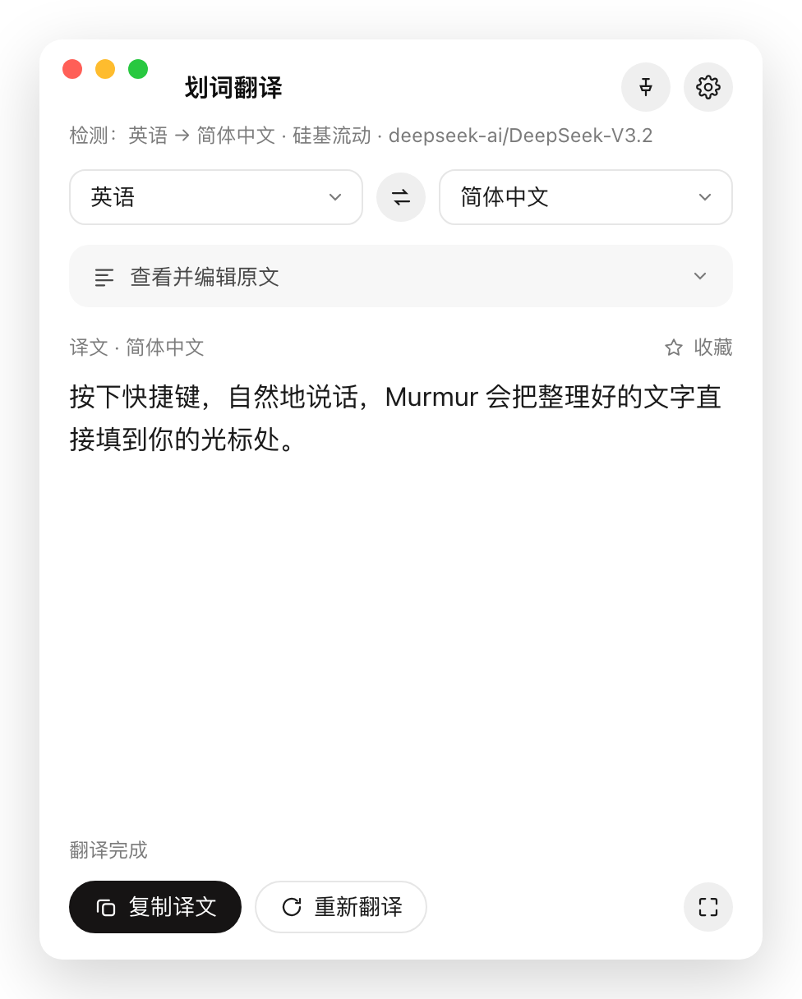
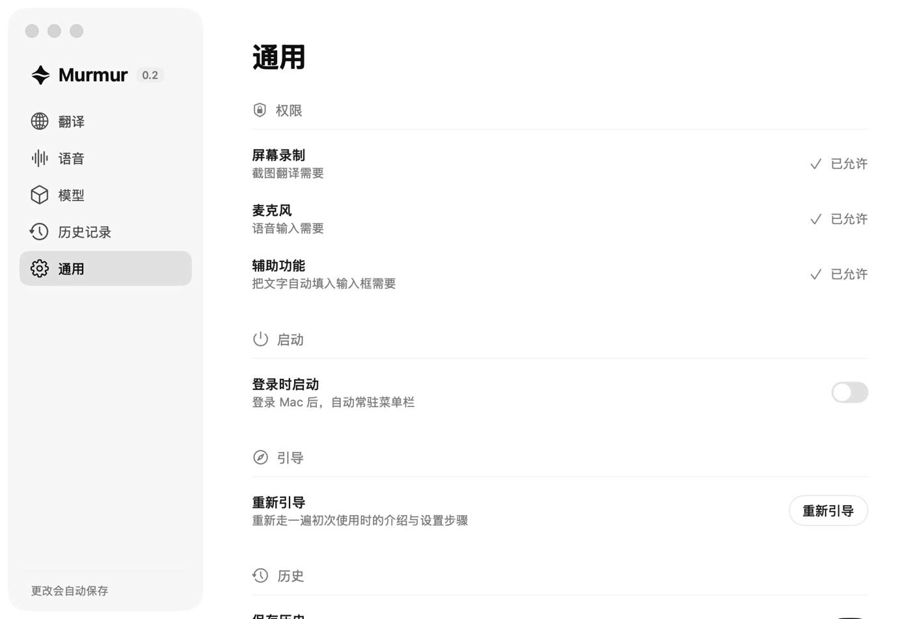

# Murmur

**说话就是输入，框一下就是翻译**

常驻 macOS 菜单栏。按一下快捷键说话，整理干净的文字直接落到光标处；框选或选中任何文字，立刻翻译。

### [⬇ 下载最新版](../../releases/latest) · [安装说明](安装说明.md)

---

## 它能做什么

- **语音输入** — 在任何输入框里按一下快捷键，说话，文字自动填进去
- **说完自动润色** — 去掉「嗯」「然后」这类口头语、去掉重复、说错改口只留最后一版，填进去的是能直接用的文字
- **哪都能填** — 飞书、微信、Electron 应用、网页输入框，照样填得进去
- **划词翻译** — 选中文字按 `⌥S`，不用复制粘贴、不用切窗口
- **框选翻译** — 按 `⌘E` 在屏幕上拖个框，图片、PDF、选不中的文字都能翻
- **个人词典** — 把人名、产品名、术语告诉它，不再把 Typeless 听成 Tapestry
- **历史记录** — 翻译和语音都留档，可搜索、可收藏、可导出
- **模型随你选** — 翻译、语音识别、语音整理三个位置各自选模型，用你自己的 API Key
- **不上传任何东西** — 没有服务器，你的内容只发往你自己配置的那家 AI 服务

<table>
<tr>
<td width="42%" valign="top"></td>
<td valign="top"></td>
</tr>
<tr>
<td align="center">翻译结果浮窗：可钉住、可改原文重翻</td>
<td align="center">设置：翻译、语音、模型、历史记录、通用</td>
</tr>
</table>

---

## 下载与安装

**[⬇ 到 Releases 下载最新的 `Murmur-x.x.dmg`](../../releases/latest)**

| | |
|---|---|
| **机型** | 仅支持 **Apple 芯片**（M 系列）。点左上角  →「关于本机」，写着「芯片 Apple M…」才能用 |
| **系统** | **macOS 14 (Sonoma) 或更新** |
| **账号** | **需自备一个 AI 服务的 API Key**，安装包里不含任何账号或额度 |

1. 打开 dmg，把 Murmur 拖进「应用程序」
2. **首次打开会被系统拦一次**，点「完成」→ 到「系统设置 › 隐私与安全性」翻到底部点「**仍要打开**」
3. 打开后跟着三步引导走：授权 → 接入模型 → 试一下

> 第 2 步是苹果对未做付费认证软件的统一处理，不代表软件有问题。网上说的「右键 → 打开」从 macOS 15 起已失效。完整步骤见 **[安装说明](安装说明.md)**。

还没有 API Key 的话，推荐[硅基流动](https://cloud.siliconflow.cn/account/ak)（注册送额度）。也支持 OpenAI、DeepSeek、OpenRouter、月之暗面、智谱、阿里云百炼、Groq。

推荐配置：翻译 `deepseek-ai/DeepSeek-V3.2` ｜ 语音识别 `Qwen/Qwen3-ASR-1.7B`

---

## 怎么用

### 语音输入 `Home`

在目标输入框里按一下开始，再按一下结束（也可以改成按住说话）。屏幕底部出现黑色浮条：左边取消、右边确认、中间是实时波形。

**等提示音响过再开口**——蓝牙耳机的通话链路要一秒多才接通，之前的声音录不到。浮条在就绪前会写着「等提示音再说」。

说完文字直接填到光标处，**成功时不弹任何提示**。只有三种情况确实填不进去，才会把文字复制到剪贴板并提示你按 `⌘V`：没给辅助功能权限、光标在密码框、或者触发时 Murmur 自己在前台。

### 划词翻译 `⌥S`

在任何 App 里选中一段文字按下即翻译。它会先读系统的选中文本，读不到时退回模拟一次复制——**并且会把你原本的剪贴板内容还原**。

### 框选翻译 `⌘E`

按下后屏幕变暗，拖一个框住要翻译的内容，松手即翻译。`Esc` 或右键取消。适合图片、PDF、和任何选不中文字的地方。

### 改快捷键

设置 →「翻译」或「语音」页，**点一下快捷键那个框，直接按下新的组合键就录进去了**，不弹窗、不用确认；按 `Esc` 取消。支持单独 `Home`、`Fn`、F1–F20，或修饰键加普通键。

---

## 常见问题

<b>更新后突然不好使了？</b>

这一版用的是临时签名，**每次更新，三项系统权限都会失效**。去「系统设置 › 隐私与安全性」，在「辅助功能」「麦克风」「屏幕录制」里把 Murmur **先用减号删掉，再重新添加**——只把开关关掉再打开是没用的。

给完辅助功能后**必须退出 App 重新打开**才生效。

<b>文字填不进去，只能自己粘贴？</b>

九成是「辅助功能」权限没给，或者给完没重启 App。设置 →「通用」页能看到三项权限的状态。

另外，对着 Murmur 自己的窗口触发是不会填的，要切到别的 App。

<b>识别不准，把产品名、人名听错？</b>

设置 →「语音」→「个人词典」，把标准写法和常见的错写法加进去（例如标准词 `Typeless`，误识别写法 `Tablist, tablet`）。整理文字时会参照词典纠正。

如果连普通词都听不准，换个识别模型试试——设置 →「模型」→「语音识别」。

<b>录音没声音 / 识别结果是空的？</b>

戴蓝牙耳机时，通话链路要一秒多才接通。**等提示音响过再开口**，浮条在那之前会写着「等提示音再说」。

还是不行的话：菜单栏 Murmur →「语音输入检查」，它会在本机录 5 秒确认麦克风是否真的采到声音（录音不上传，检查完即删）。

<b>整理会不会把我说的意思改了？</b>

整理只动说法，不动内容：事实、数字、否定、条件、请求都必须保留，不做摘要，也不会替你回答口述里的问题。识别原文始终完整保留在语音结果窗和历史记录里，可以随时对照。

<b>快捷键跟别的软件撞了？</b>

直接改：设置 →「翻译」或「语音」页，点快捷键框按新的键。如果按下的键已被系统或别的功能占用，框下面会直接说明原因，换一个再按即可。

---

## 隐私

**Murmur 没有服务器，不收集任何数据。**

你框选的图片、选中的文字、录下的语音，只会发送到**你自己配置的那家 AI 服务**（比如硅基流动），由那家服务处理。除此之外不经过任何第三方。

API Key 存在 macOS 钥匙串里；历史记录和设置存在本机 `~/Library/Application Support/com.kangl.murmur/`，都不上传。语音记录可以随时在「历史记录」页清空，也可以在「通用」页关掉自动保存。

---

## 已知限制

- 不支持 Intel 芯片的 Mac
- 每次更新后三项权限会失效，需要重新添加（要先删再加）
- 未做 Apple 付费认证，首次打开需要手动放行
- 目前是内测版本，功能可用但仍在打磨

---

## 反馈

用着有问题或者有想法，欢迎提 [Issue](../../issues)。报问题时麻烦附上 macOS 版本和 Murmur 版本号（设置窗口左上角能看到）。

---

© 2026 Murmur · 本仓库仅分发安装包与文档，不含源代码

